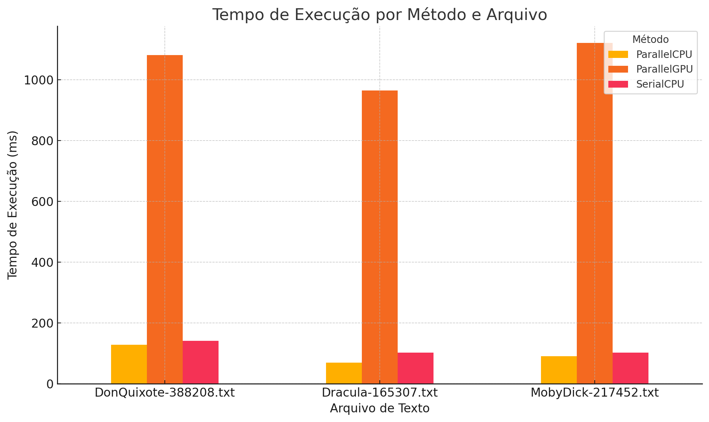
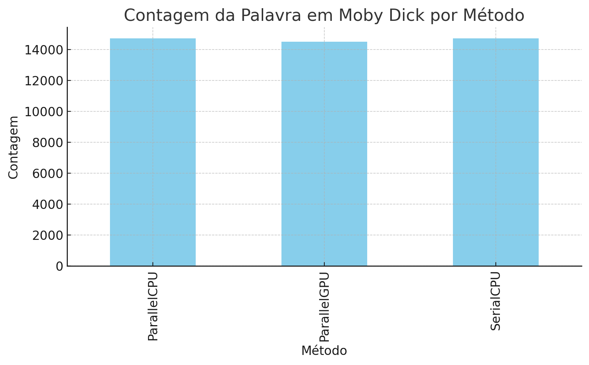
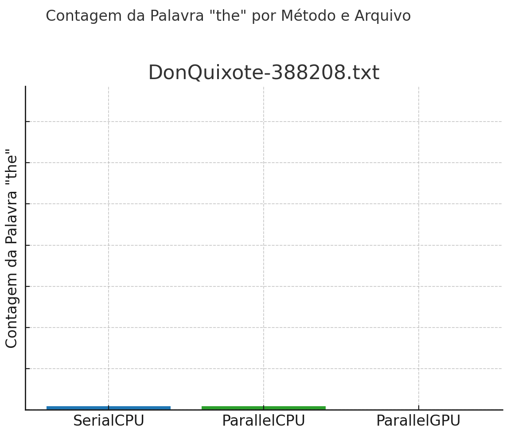
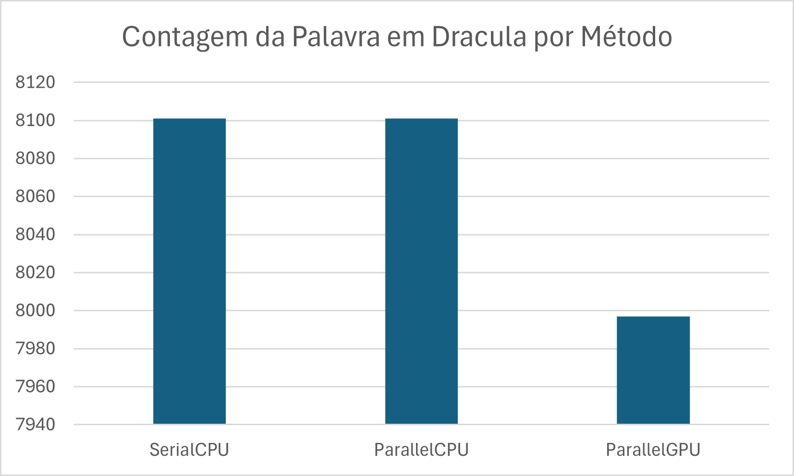

# 📊 Análise de Desempenho de Algoritmos de Busca em Arquivos de Texto

## 🧾 Resumo

Este projeto tem como objetivo comparar o desempenho de diferentes abordagens para algoritmos de busca em arquivos de texto: execução sequencial (CPU), paralela (multi-threaded na CPU) e paralela utilizando a GPU (via JCuda). Os tempos de execução e a precisão da contagem foram analisados em diferentes obras literárias, gerando resultados estatísticos e gráficos comparativos.

## 🧭 Introdução

O projeto analisa três métodos para contar ocorrências de uma palavra em textos longos:

- **SerialCPU**: abordagem sequencial tradicional utilizando um único thread.
- **ParallelCPU**: abordagem paralela utilizando múltiplos threads da CPU.
- **ParallelGPU**: abordagem utilizando a GPU para acelerar a contagem com JCuda.

Esses métodos foram aplicados a três obras literárias: *Moby Dick*, *Dom Quixote* e *Drácula*, buscando a palavra `"the"`.

## 🧪 Metodologia

A metodologia adotada foi a seguinte:

- **Implementação de Algoritmos**: Criação dos três algoritmos de busca mencionados em Java.
- **Framework de Testes**: Desenvolvimento de uma estrutura de testes para medir tempos de execução e registrar contagens.
- **Execução em Ambientes Variados**: Testes foram realizados em arquivos de diferentes tamanhos para simular diferentes cargas de trabalho.
- **Registro de Dados**: Armazenamento dos dados em arquivos CSV.
- **Análise Estatística**: Cálculo de médias de execução e análise da acurácia da contagem.
- **Visualização**: Geração de gráficos para ilustrar comparações de performance.

## 📈 Resultados e Discussão

Abaixo estão os dados obtidos nos testes com as obras literárias, buscando a palavra `"the"`:

| TextFile              | Method      | Count | Execution Time (ms) |
|-----------------------|-------------|-------|----------------------|
| MobyDick-217452.txt   | SerialCPU   | 14715 | 102                  |
|                       | ParallelCPU | 14715 | 91                   |
|                       | ParallelGPU | 14512 | 1121                 |
| DonQuixote-388208.txt | SerialCPU   | 188   | 141                  |
|                       | ParallelCPU | 188   | 128                  |
|                       | ParallelGPU | 186   | 1081                 |
| Dracula-165307.txt    | SerialCPU   | 8101  | 102                  |
|                       | ParallelCPU | 8101  | 70                   |
|                       | ParallelGPU | 7997  | 965                  |

### 💬 Observações

- A abordagem **ParallelCPU** mostrou-se consistentemente mais rápida que a **SerialCPU**, mantendo a precisão dos resultados.
- A abordagem **ParallelGPU**, embora promissora, apresentou resultados imprecisos na contagem e tempos de execução superiores, possivelmente por sobrecarga na comunicação com a GPU ou limitações da biblioteca JCuda.
- A precisão da contagem foi significativamente afetada no método GPU, o que compromete sua confiabilidade nos testes atuais.

### 📊 Gráficos

#### Comparação de Tempo de Execução

#### Comparação de Métodos (por obra)

## ✅ Conclusão

A análise dos testes evidencia que:

- O **ParallelCPU** é a abordagem mais eficiente e precisa para a tarefa de busca em texto.
- O **SerialCPU** é confiável, mas mais lento.
- O **ParallelGPU**, apesar do potencial de paralelismo massivo, apresentou problemas de acurácia e não obteve desempenho superior ao ParallelCPU nas condições testadas.

A abordagem paralela na CPU representa o melhor custo-benefício neste experimento.

## 📚 Referências

- Oracle Java Documentation – https://docs.oracle.com/javase/
- JCuda – https://www.jcuda.org/
- Project Gutenberg (para os textos) – https://www.gutenberg.org/

## 📎 Anexos

### Códigos das Implementações

Os principais arquivos do projeto estão listados abaixo:

- `PerformanceAnalyzer.java` – Classe responsável pela execução dos testes.
- `SearchStrategies.java` – Contém as implementações de busca Serial, Paralela CPU e Paralela GPU.
- `CSVGenerator.java` – Gera os arquivos CSV com os dados de teste.
- `ChartGenerator.java` – Gera os gráficos de desempenho.

### 📦 Link do Projeto no GitHub

> 🔗 [Acesse o repositório completo no GitHub](https://github.com/gabrielxmarinho/projeto-busca-texto)